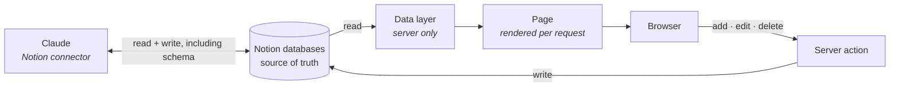

# Life Dashboard
## Stack

| | |
|---|---|
| **Next.js 16** | App Router — pages render on the server, per request |
| **React 19** | interactive tabs are client components; everything else is server-rendered |
| **Tailwind v4** | design tokens in `globals.css` — paper, ink, kale, chili, gold |
| **Recharts** | the projection, spending and weight charts |
| **Notion REST API** | every real number lives in a Notion database |

## Deployment

Vercel builds and hosts the site from the **`main`** branch on GitHub — pushing to `main` is the deploy.

Pages are server-rendered per request rather than built once, so a change made in Notion shows up on the
next load. There is nothing to rebuild after editing data.

Two things have to be true for a database to appear:

1. its ID is set as an environment variable in the Vercel project, and
2. the Notion integration behind `NOTION_API_KEY` has been granted access to that database.

Miss either and the tab explains what it wants instead of failing. A partial setup is therefore a safe
state — and an easy one to overlook.

## How data flows

The Notion token never reaches the browser: the browser talks to this app, and only this app talks to
Notion.

### Two things write to Notion

**The dashboard**, through server actions. These are constrained to the shapes the app knows about —
each feature keeps one table of Notion property names and types, used for both reading and writing, so
the two can't drift apart.

**Claude**, through the Notion connector, working directly against the databases. This is how the
Relationships database was created and later extended, and it isn't limited to rows: Claude can add
properties, change their types and reorganise a database.

That second path is the one to be careful with. The app matches Notion properties **by name**, so if a
property is renamed or retyped outside the app, the corresponding reader quietly returns nothing rather
than erroring — the tab just looks empty. A schema change made through Claude needs the matching change
in the app's property tables.

## Tabs

| Tab | Routes | Data |
|---|---|---|
| **Money** | `/money/projection` · `/money/logs` · `/money/spending` | projection assumptions, four asset logs, spending, shopping list |
| **Health** | `/health/diet` · `/health/fitness` | diet menu (smoothies, meal prep, one-off dishes); fitness reads weight and blood pressure |
| **Relationship** | `/relationship/location` | people, pinned on a generated world map |
| **Dummy** | `/dummy/**` — mirrors every tab above | invented fixtures; writes are refused, so it needs no databases |

A `real | dummy` switch in the header swaps between a tab and its stand-in copy. The dummy routes exist
to show or screenshot the dashboard without exposing real figures — and because they share their
components with the live tabs, every write path checks the route first and refuses.

> **Note**
> `/dummy` ships with the app. Once deployed it is reachable by anyone with the URL. It holds no real
> data, which is the point, but it is not hidden.

## Environment

Set in the Vercel project, not in the repository.

| Variable | What it feeds |
|---|---|
| `NOTION_API_KEY` | the integration token every call uses — without it, nothing loads |
| `NOTION_MONEY_PROJECTION_ASSUMPTIONS_ID` | Money · Projection |
| `NOTION_INVESTMENTS_VALUE_LOG_ID` | Money · Logs |
| `NOTION_SAVINGS_LOG_ID` | Money · Logs |
| `NOTION_SUPERANNUATION_LOG_ID` | Money · Logs |
| `NOTION_STOCK_OPTIONS_LOG_ID` | Money · Logs |
| `NOTION_SPENDING_ID` | Money · Spending |
| `NOTION_SHOPPING_LIST_ID` | Money · Spending |
| `NOTION_WEIGHT_LOG_ID` | Health · Fitness |
| `NOTION_BP_LOG_ID` | Health · Fitness |
| `NOTION_SMOOTHIES_ID` | Health · Diet |
| `NOTION_MEAL_PREP_ID` | Health · Diet |
| `NOTION_ONE_OFF_ID` | Health · Diet |
| `NOTION_RELATIONSHIPS_ID` | Relationship · Location |

## Generated files

`app/lib/worldMap.ts` holds the country outlines the relationship map draws. It is generated from
Natural Earth data by `scripts/build-world-map.mjs` — rerun the script rather than editing the file.
